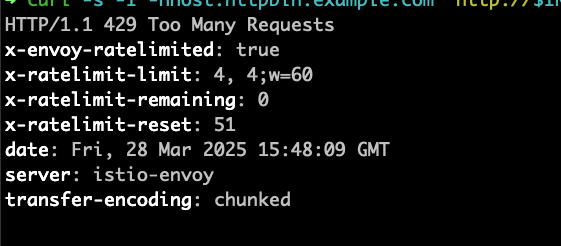

# Rate Limit Simple Scenaroi

In this scenario we will apply the EnvoyFilters and the istio rate limit configuration,
The full details are described on the blog itself.

1. head to the root directory of this reposiotry
2. Run the following commad to apply the contet of this part

```sh
kubectl apply -f ./2-ratelimit-simple
kubectl apply -f ./2-ratelimit-simple/envoy-filters
```

3. as in previous section set up the Ingress host and port and run the curl command 4 times .the fifth time should be blocked with 429 error code 

```sh
export INGRESS_NAME=istio-ingressgateway
export INGRESS_NS=istio-system

export INGRESS_HOST=$(kubectl -n "$INGRESS_NS" get service "$INGRESS_NAME" -o jsonpath='{.status.loadBalancer.ingress[0].ip}')
export INGRESS_PORT=$(kubectl -n "$INGRESS_NS" get service "$INGRESS_NAME" -o jsonpath='{.spec.ports[?(@.name=="http2")].port}')

# try to reach the rate limitation
for i in {1..5}; do
  curl -s -I -HHost:httpbin.example.com "http://$INGRESS_HOST:$INGRESS_PORT/status/200"
done

```
notice the headers on the http response.


